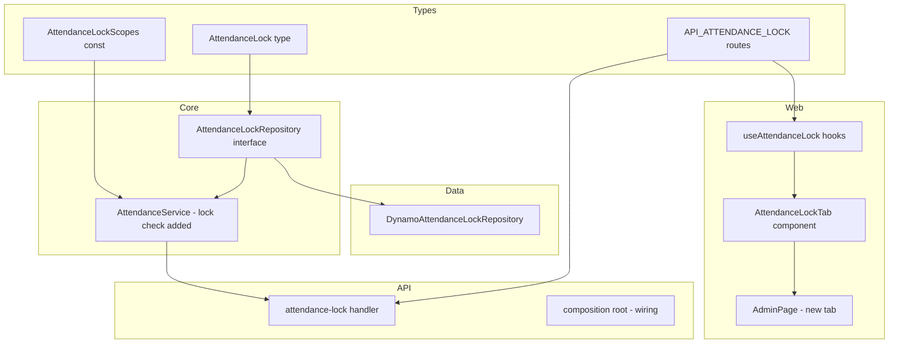
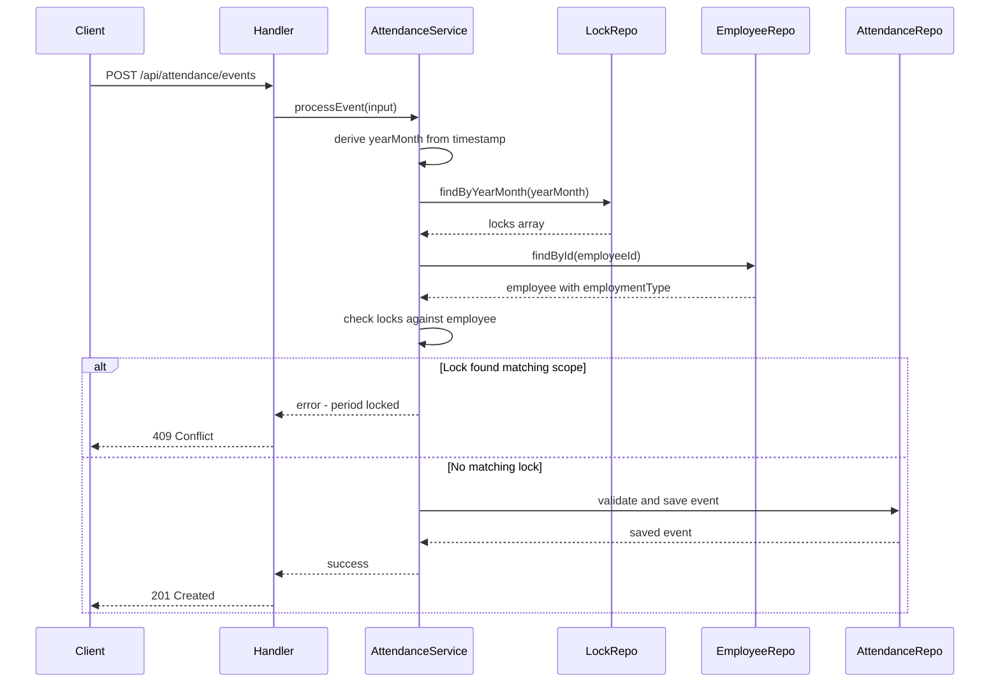
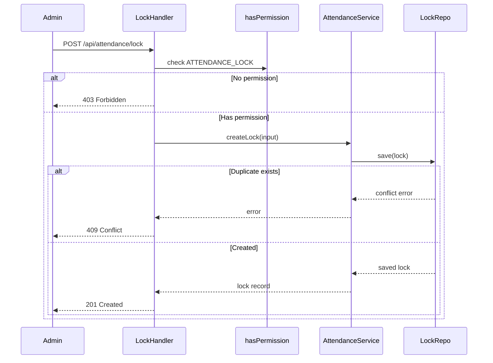

# Design Document: Attendance Locking

## Overview

**Purpose**: This feature allows administrators to lock attendance for a given period, preventing clock events and edits. Locks are scoped at company, group (employment type), or individual employee level.

**Users**: Administrators use the admin panel to lock/unlock periods after payroll finalization. All employees (web and Slack) are affected by lock enforcement.

**Impact**: Adds a new entity type, repository, DynamoDB adapter, API endpoints, and admin UI tab. Modifies `AttendanceService.processEvent` to enforce locks.

### Goals
- Lock attendance by yearMonth at three scope levels (company, group, employee)
- Reject clock events for locked periods across web and Slack channels
- Provide admin UI with month picker and lock/unlock controls
- Gate all lock operations with `Permissions.ATTENDANCE_LOCK`

### Non-Goals
- Bulk lock/unlock of multiple months in a single operation
- Lock history or audit trail for lock/unlock actions (covered by existing audit system)
- Employee-visible lock status indicator on their dashboard
- Automatic locking via cron (manual admin action only)

## Architecture

### Existing Architecture Analysis

The attendance system follows handler → service → repository. `AttendanceService.processEvent` is the single processing point for all clock events (web API and Slack SQS). Key integration points:

- `processEvent` validates state transitions, idempotency, and persists events
- `AttendanceService` constructor takes `(attendanceRepo, auditRepo)`
- `Employee.employmentType` is the natural group identifier, matching policy cascade groups
- Admin panel uses a tab-based layout with `ADMIN_TAB_IDS` array

### Architecture Pattern & Boundary Map



**Architecture Integration**:
- Selected pattern: Extend existing hexagonal architecture with new repository interface + adapter
- Domain boundaries: `types` owns entity/route definitions, `core` owns service logic + repository interface, `data` owns DynamoDB adapter, `api` owns handler, `web` owns UI
- Existing patterns preserved: handler → service → repository, DI via composition root, shared types, KeyPatterns for DynamoDB keys

### Technology Stack

| Layer | Choice / Version | Role in Feature | Notes |
|-------|------------------|-----------------|-------|
| Shared Types | `@hr-attendance-app/types` | `AttendanceLock`, `AttendanceLockScope`, API routes | No new dependencies |
| Business Logic | `@hr-attendance-app/core` | Lock check in `processEvent`, repository interface | Adds `EmployeeRepository` dep to `AttendanceService` |
| Data Layer | `@hr-attendance-app/data` | `DynamoAttendanceLockRepository` | No new dependencies |
| Backend | `@hr-attendance-app/api` | Lock handler endpoints | No new dependencies |
| Frontend | `@hr-attendance-app/web` | `AttendanceLockTab`, React Query hooks | No new dependencies |

## System Flows

### Lock Enforcement Flow



### Lock Management Flow



## Requirements Traceability

| Requirement | Summary | Components | Interfaces | Flows |
|-------------|---------|------------|------------|-------|
| 1.1–1.7 | Lock entity fields | AttendanceLockType | `AttendanceLock`, `AttendanceLockScope` | — |
| 2.1–2.6 | Lock enforcement on clock events | LockEnforcement | `processEvent` lock check | Lock enforcement |
| 3.1–3.5 | Lock storage and retrieval | LockStorage | `AttendanceLockRepository` | — |
| 4.1–4.7 | Lock management API | LockAPI | POST/DELETE/GET endpoints | Lock management |
| 5.1–5.8 | Admin UI for lock management | LockUI | `AttendanceLockTab`, hooks | — |
| 6.1–6.2 | Slack enforcement | SlackEnforcement | Same `processEvent` | Lock enforcement |

## Components and Interfaces

| Component | Domain/Layer | Intent | Req Coverage | Key Dependencies | Contracts |
|-----------|-------------|--------|--------------|------------------|-----------|
| AttendanceLockType | types | Define lock entity and scope constants | 1.1–1.7 | None | — |
| LockRoutes | types | API route constants and body types | 4.1–4.7 | None | API |
| AttendanceLockRepository | core/repositories | Lock persistence interface | 3.1–3.5 | None | Service |
| LockEnforcement | core/attendance | Lock check in processEvent | 2.1–2.6, 6.1–6.2 | AttendanceLockRepository (P0), EmployeeRepository (P0) | Service |
| DynamoAttendanceLockRepository | data/dynamo | DynamoDB lock adapter | 3.1–3.5 | DynamoDB client (P0) | — |
| LockHandler | api/handlers | Lock management endpoints | 4.1–4.7 | LockEnforcement (P0), Permissions (P0) | API |
| LockHooks | web/hooks | React Query hooks for locks | 5.1–5.8 | LockRoutes (P0) | State |
| AttendanceLockTab | web/components | Admin lock management UI | 5.1–5.8 | LockHooks (P0) | State |

### Types Layer

#### AttendanceLockType

| Field | Detail |
|-------|--------|
| Intent | Define the attendance lock entity, scope constants, and related types |
| Requirements | 1.1, 1.2, 1.3, 1.4, 1.5, 1.6, 1.7 |

**Contracts**: Service [x]

##### Service Interface
```typescript
// Added to types/src/attendance.ts

export type AttendanceLockScope = "COMPANY" | "GROUP" | "EMPLOYEE";

export interface AttendanceLock {
  readonly id: string;
  readonly scope: AttendanceLockScope;
  readonly yearMonth: string;
  readonly groupId?: string;
  readonly employeeId?: string;
  readonly lockedBy: string;
  readonly lockedAt: string;
}
```

```typescript
// Added to types/src/constants.ts

export const AttendanceLockScopes = {
  COMPANY: "COMPANY",
  GROUP: "GROUP",
  EMPLOYEE: "EMPLOYEE",
} as const;
```

#### LockRoutes

| Field | Detail |
|-------|--------|
| Intent | Define API route constants and typed request/response bodies for lock operations |
| Requirements | 4.1, 4.3, 4.5, 4.7 |

**Contracts**: API [x]

##### API Contract
```typescript
// Added to types/src/api-routes.ts

export const API_ATTENDANCE_LOCK = "/api/attendance/lock" as const;

export interface CreateAttendanceLockBody {
  readonly scope: "COMPANY" | "GROUP" | "EMPLOYEE";
  readonly yearMonth: string;
  readonly groupId?: string;
  readonly employeeId?: string;
}

export interface DeleteAttendanceLockBody {
  readonly scope: "COMPANY" | "GROUP" | "EMPLOYEE";
  readonly yearMonth: string;
  readonly groupId?: string;
  readonly employeeId?: string;
}

export interface AttendanceLockQueryParams {
  readonly yearMonth?: string;
  readonly scope?: "COMPANY" | "GROUP" | "EMPLOYEE";
}
```

### Core Layer

#### AttendanceLockRepository

| Field | Detail |
|-------|--------|
| Intent | Define the port interface for lock persistence operations |
| Requirements | 3.1, 3.2, 3.3, 3.4, 3.5 |

**Contracts**: Service [x]

##### Service Interface
```typescript
// New file: core/src/repositories/attendance-lock.ts

export interface AttendanceLockRepository {
  findByYearMonth(yearMonth: string, scope?: AttendanceLockScope): Promise<readonly AttendanceLock[]>;
  save(lock: AttendanceLock): Promise<AttendanceLock>;
  delete(yearMonth: string, scope: AttendanceLockScope, targetId?: string): Promise<void>;
}
```
- Preconditions: `yearMonth` in YYYY-MM format
- Postconditions: `save` rejects duplicates (same scope + target + yearMonth)
- Invariants: `findByYearMonth` without scope returns all locks for the period; with scope filters by `begins_with(SK, scope)`
- `delete` uses yearMonth + scope + targetId to construct PK/SK directly — no ID-based lookup needed
- Lock `id` is deterministic: `LOCK#<yearMonth>#<scope>#<targetId>` (e.g., `LOCK#2026-03#COMPANY`, `LOCK#2026-03#GROUP#JP_FULL_TIME`)

#### LockEnforcement

| Field | Detail |
|-------|--------|
| Intent | Add lock validation to processEvent and expose lock CRUD methods on AttendanceService |
| Requirements | 2.1, 2.2, 2.3, 2.4, 2.5, 2.6, 6.1, 6.2 |

**Dependencies**
- Inbound: All handlers and Slack processor calling `processEvent` (P0)
- Outbound: `AttendanceLockRepository` (P0), `EmployeeRepository` (P0) — for group-scope resolution

**Contracts**: Service [x]

##### Service Interface
```typescript
// Enhanced AttendanceService constructor and new methods

constructor(
  attendanceRepo: AttendanceRepository,
  auditRepo: AuditRepository,
  lockRepo: AttendanceLockRepository,
  employeeRepo: EmployeeRepository,
)

// New methods on AttendanceService
async createLock(input: CreateAttendanceLockInput): Promise<Result<AttendanceLock, string>>;
async removeLock(yearMonth: string, scope: AttendanceLockScope, targetId?: string): Promise<void>;
async getLocksForMonth(yearMonth: string): Promise<readonly AttendanceLock[]>;
```

```typescript
interface CreateAttendanceLockInput {
  readonly scope: AttendanceLockScope;
  readonly yearMonth: string;
  readonly groupId?: string;
  readonly employeeId?: string;
  readonly lockedBy: string;
}
```

**Lock check logic in processEvent** (inserted before idempotency check):
1. Derive `yearMonth` from `input.timestamp` using `isoToYearMonth`
2. Query all locks for that `yearMonth`
3. If any lock has `scope: COMPANY` → reject
4. If any lock has `scope: GROUP` and employee's `employmentType` matches `groupId` → reject
5. If any lock has `scope: EMPLOYEE` and employee's `id` matches `employeeId` → reject
6. Error message includes scope and yearMonth: `"Period <yearMonth> is locked (scope: <scope>)"`

**Implementation Notes**
- Employee lookup is needed only when group-scope locks exist for the period
- If no locks found, skip employee lookup entirely (optimization)
- If only company or employee-scope locks exist, no employee lookup needed either

### Data Layer

#### DynamoAttendanceLockRepository

| Field | Detail |
|-------|--------|
| Intent | DynamoDB adapter for lock storage using single-table design |
| Requirements | 3.1, 3.2, 3.3, 3.4, 3.5 |

**DynamoDB Key Design**:

| Operation | PK | SK | Notes |
|-----------|----|----|-------|
| Company lock | `LOCK#2026-03` | `COMPANY` | One per yearMonth |
| Group lock | `LOCK#2026-03` | `GROUP#JP_FULL_TIME` | One per group per yearMonth |
| Employee lock | `LOCK#2026-03` | `EMP#EMP001` | One per employee per yearMonth |
| Query all for month | `PK = LOCK#2026-03` | — | Returns all scopes |
| Delete specific lock | `LOCK#2026-03` | `COMPANY` or `GROUP#X` or `EMP#X` | Direct key access from scope + target |

**Key patterns to add**:
```typescript
// Added to types/src/key-patterns.ts
LOCK: "LOCK",

// Added to data/src/dynamo/keys.ts
LOCK: (yearMonth: string) => `LOCK#${yearMonth}`,
LOCK_SK_COMPANY: "COMPANY",
LOCK_SK_GROUP: (groupId: string) => `GROUP#${groupId}`,
LOCK_SK_EMP: (employeeId: string) => `EMP#${employeeId}`,
```

**Duplicate prevention**: `PutCommand` with `ConditionExpression: "attribute_not_exists(PK) AND attribute_not_exists(SK)"`

**Implementation Notes**
- `id` field is deterministic: `LOCK#<yearMonth>#<scope>#<target>` — derived from PK/SK, not stored separately
- No GSI needed — all queries use the main table PK
- `delete` reconstructs PK/SK from `yearMonth + scope + targetId` — no ID-based lookup needed
- `findByYearMonth` with optional `scope` filter uses `begins_with(SK, scope)` for DynamoDB-level filtering

### API Layer

#### LockHandler

| Field | Detail |
|-------|--------|
| Intent | Expose lock management endpoints gated by ATTENDANCE_LOCK permission |
| Requirements | 4.1, 4.2, 4.3, 4.4, 4.5, 4.6, 4.7 |

**Dependencies**
- Inbound: HTTP requests (P0)
- Outbound: `hasPermission` from `@hr-attendance-app/core` (P0), `AttendanceService` lock methods (P0)

**Contracts**: API [x]

##### API Contract

| Method | Endpoint | Request | Response | Errors |
|--------|----------|---------|----------|--------|
| POST | `/api/attendance/lock` | `CreateAttendanceLockBody` | `AttendanceLock` (201) | 403, 400, 409 |
| DELETE | `/api/attendance/lock` | `DeleteAttendanceLockBody` | `{ deleted: true }` (200) | 403, 404 |
| GET | `/api/attendance/lock?yearMonth=YYYY-MM` | `AttendanceLockQueryParams` | `AttendanceLock[]` (200) | 403, 400 |

**Implementation Notes**
- All three endpoints gated by `hasPermission(auth.data, Permissions.ATTENDANCE_LOCK)`
- POST validates `yearMonth` matches `/^\d{4}-\d{2}$/` pattern
- POST validates scope-specific fields: GROUP requires `groupId`, EMPLOYEE requires `employeeId`
- Handler delegates to `AttendanceService.createLock`, `removeLock`, `getLocksForMonth`

### Web Layer

#### LockHooks

| Field | Detail |
|-------|--------|
| Intent | React Query hooks for lock CRUD operations |
| Requirements | 5.1, 5.2, 5.6 |

Summary-only component — follows existing hook patterns in `hooks/queries/`.

**Contracts**: State [x]

##### State Management
```typescript
// New file: web/src/hooks/queries/useAttendanceLock.ts

export function useAttendanceLocks(yearMonth: string): UseQueryResult<AttendanceLock[]>;
export function useCreateLock(): UseMutationResult<AttendanceLock, Error, CreateAttendanceLockBody>;
export function useDeleteLock(): UseMutationResult<void, Error, string>;
```

#### AttendanceLockTab

| Field | Detail |
|-------|--------|
| Intent | Admin UI component for managing attendance locks per month |
| Requirements | 5.1, 5.2, 5.3, 5.4, 5.5, 5.6, 5.7, 5.8 |

**Dependencies**
- Inbound: AdminPage conditional render (P0)
- Outbound: `useAttendanceLocks`, `useCreateLock`, `useDeleteLock` hooks (P0)

**Contracts**: State [x]

##### State Management
- Month picker state: `useState<string>` initialized to current yearMonth via `formatYearMonth`
- Lock status derived from query data: check if company lock exists for selected month
- Lock button calls `useCreateLock` with `{ scope: "COMPANY", yearMonth }`
- Unlock button calls `useDeleteLock` with the lock's id
- Error/success feedback via mutation state (`isError`, `error.message`)

**Implementation Notes**
- Initial scope: company-level lock/unlock only (simplest UX). Group and employee scope can be added as dropdown selectors in a follow-up
- All text uses i18n keys under `admin.lock.*` namespace
- Uses `useHasPermission(Permissions.ATTENDANCE_LOCK)` for conditional rendering

## Data Models

### Domain Model

**AttendanceLock** aggregate:
- Identifies a frozen period at a specific scope
- Immutable once created (no edits — only create/delete)
- Business rule: no two locks with same (scope, target, yearMonth)

### Physical Data Model (DynamoDB)

| Attribute | Type | Description |
|-----------|------|-------------|
| PK | String | `LOCK#<yearMonth>` |
| SK | String | `COMPANY`, `GROUP#<groupId>`, or `EMP#<employeeId>` |
| id | String | Unique lock identifier |
| scope | String | `COMPANY`, `GROUP`, or `EMPLOYEE` |
| yearMonth | String | `YYYY-MM` |
| groupId | String (optional) | Employment type for GROUP scope |
| employeeId | String (optional) | Employee ID for EMPLOYEE scope |
| lockedBy | String | Actor ID who created the lock |
| lockedAt | String | ISO timestamp |

No GSI needed. All queries use PK-based access.

## Error Handling

### Error Categories and Responses
- **Period locked** (409): `processEvent` returns `{ success: false, error: "Period 2026-03 is locked (scope: COMPANY)" }`
- **Duplicate lock** (409): `createLock` returns `{ success: false, error: "Lock already exists for this scope and period" }`
- **Invalid yearMonth** (400): Handler validates format before processing
- **Insufficient permissions** (403): Handler returns `ErrorMessages.INSUFFICIENT_PERMISSIONS`
- **Lock not found** (404): `removeLock` when lock ID doesn't exist

## Testing Strategy

### Unit Tests (core/attendance)
1. `processEvent` rejects event when company-scope lock exists for the yearMonth
2. `processEvent` rejects event when group-scope lock matches employee's employment type
3. `processEvent` rejects event when employee-scope lock matches employee ID
4. `processEvent` succeeds when no matching lock exists
5. `processEvent` succeeds when locks exist for a different yearMonth
6. `createLock` returns conflict error when duplicate lock exists
7. Error message includes scope and yearMonth

### Unit Tests (types)
1. `AttendanceLockScopes` contains COMPANY, GROUP, EMPLOYEE
2. Lock-related API route constants are defined

### Integration Tests (api/handlers)
1. POST lock returns 201 with valid input and ATTENDANCE_LOCK permission
2. POST lock returns 403 without ATTENDANCE_LOCK permission
3. POST lock returns 409 for duplicate lock
4. DELETE lock returns 200 and removes the lock
5. GET locks returns all locks for a yearMonth
6. Clock event returns 409 when period is locked

### Frontend Tests (web)
1. AttendanceLockTab renders month picker and lock button
2. Lock button creates company-scope lock for selected month
3. Unlock button removes existing lock
4. Tab only visible to users with ATTENDANCE_LOCK permission

## Security Considerations

- All lock management endpoints gated by `Permissions.ATTENDANCE_LOCK` (ADMIN+ only)
- Lock enforcement is server-side in `processEvent` — cannot be bypassed by frontend
- `lockedBy` field provides accountability for who locked a period
- No data destruction: locking prevents new events but does not delete existing ones
