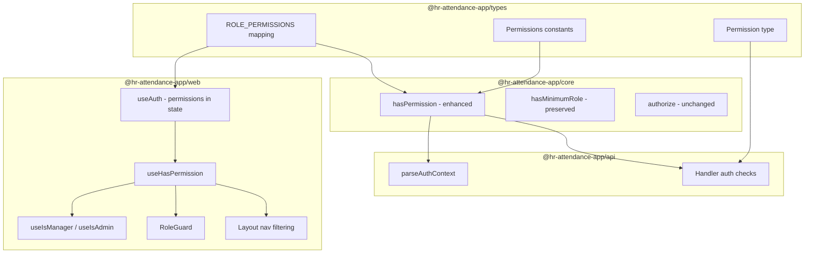
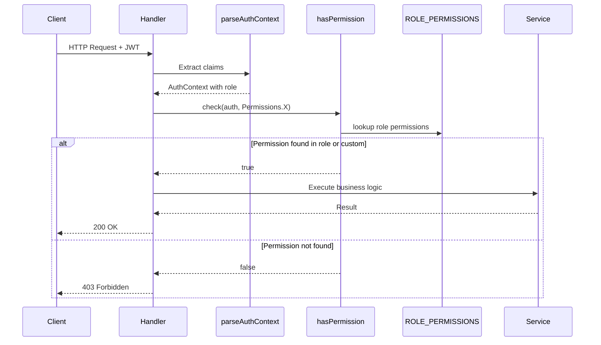
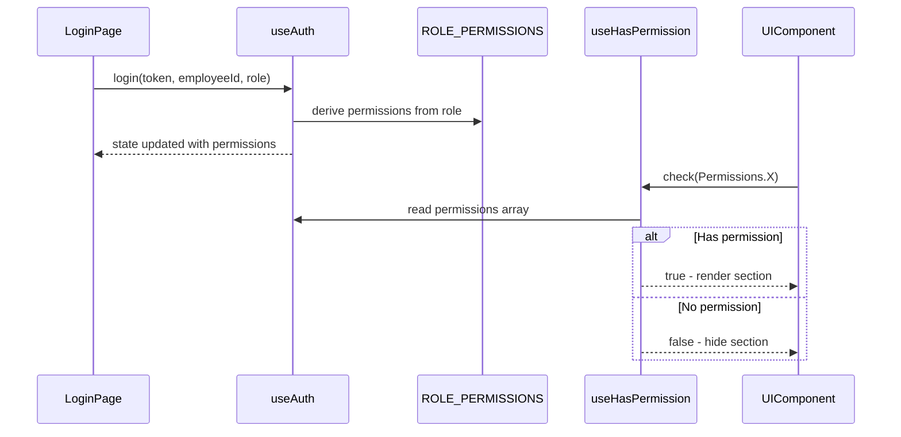

# Design Document: Permission-Based RBAC

## Overview

**Purpose**: This feature replaces the hierarchical `hasMinimumRole` authorization model with granular, permission-based access control. Each API action is gated by a named permission constant, and roles map to default permission sets.

**Users**: All authenticated users benefit — employees see only permitted UI, managers see approval sections, admins see full management. Developers benefit from type-safe permission constants.

**Impact**: Changes authorization checks across 6 backend handler files, the permission engine, frontend auth state, route guards, and navigation filtering. No database schema changes.

### Goals
- Replace `hasMinimumRole` with `hasPermission` as the primary authorization mechanism
- Define typed `Permissions` constants and `ROLE_PERMISSIONS` mapping in shared types
- Maintain backward compatibility — `hasMinimumRole`, `ROLE_HIERARCHY`, `authorize` all preserved
- Frontend permission checks via `useHasPermission` hook

### Non-Goals
- Custom per-user permission management UI (future — uses `actorCustomPermissions` field already in place)
- Database-stored role definitions (roles remain code-defined constants)
- Cognito JWT custom claims for permissions (future integration point)
- Permission-aware ABAC `authorize()` function changes (continues using `hasMinimumRole` internally)

## Architecture

### Existing Architecture Analysis

The current system uses a 5-level role hierarchy (`EMPLOYEE < MANAGER < HR_MANAGER < ADMIN < SUPER_ADMIN`) with numeric level comparison via `hasMinimumRole`. Key patterns:

- **Backend**: Handlers call `hasMinimumRole(auth.data.actorRole, Roles.X)` after `parseAuthContext` extracts `AuthContext` from JWT claims
- **Frontend**: `useHasMinimumRole` / `useIsManager` / `useIsAdmin` hooks compare numeric role levels; `RoleGuard` and `Layout` nav filter by `minRole`
- **Existing scaffold**: `AuthContext.actorCustomPermissions` field exists but is always `[]`; `hasPermission` function exists but only checks custom permissions, not role-derived ones

Integration points preserved:
- `parseAuthContext` in `api/src/middleware/index.ts` — enhanced, not replaced
- `authorize` ABAC function — unchanged, continues using `hasMinimumRole` internally
- All existing exports from `@hr-attendance-app/core` — preserved

### Architecture Pattern & Boundary Map



**Architecture Integration**:
- Selected pattern: Extend existing hexagonal architecture — no new layers or modules
- Domain boundaries respected: `types` owns constants, `core` owns engine logic, `api` owns handler orchestration, `web` owns UI hooks
- Existing patterns preserved: handler → service → repository, DI via composition root, shared types package
- Steering compliance: no magic strings, no CSS files, no inline dates, i18n for all user-facing text

### Technology Stack

| Layer | Choice / Version | Role in Feature | Notes |
|-------|------------------|-----------------|-------|
| Shared Types | `@hr-attendance-app/types` | `Permissions`, `Permission`, `ROLE_PERMISSIONS` constants | No new dependencies |
| Business Logic | `@hr-attendance-app/core` | Enhanced `hasPermission` engine | No new dependencies |
| Backend | `@hr-attendance-app/api` (Express dev / Lambda prod) | Handler authorization migration | No new dependencies |
| Frontend | `@hr-attendance-app/web` (React 19) | `useHasPermission` hook, guard updates | No new dependencies |

No new packages, libraries, or infrastructure changes required.

## System Flows

### Permission Check Flow (Backend)



### Permission Check Flow (Frontend)



## Requirements Traceability

| Requirement | Summary | Components | Interfaces | Flows |
|-------------|---------|------------|------------|-------|
| 1.1, 1.2, 1.3 | Permission constants and type | PermissionConstants | `Permissions`, `Permission` | — |
| 2.1, 2.2, 2.3, 2.4, 2.5 | Role-to-permission mapping | RolePermissionMap | `ROLE_PERMISSIONS` | — |
| 3.1, 3.2, 3.3, 3.4, 3.5 | Enhanced permission engine | PermissionEngine | `hasPermission()` | Backend permission check |
| 4.1–4.11 | Handler authorization migration | HandlerMigration | Handler auth patterns | Backend permission check |
| 5.1, 5.2, 5.3, 5.4 | Frontend permission hook | FrontendPermissionHook | `useHasPermission()`, `useAuth` | Frontend permission check |
| 6.1, 6.2, 6.3, 6.4, 6.5, 6.6 | Route and nav guards | RouteNavGuards | `RoleGuard`, `Layout` nav config | Frontend permission check |
| 7.1, 7.2, 7.3 | Conditional UI rendering | ConditionalUI | `useHasPermission()` in LeavePage | Frontend permission check |
| 8.1, 8.2, 8.3 | Auth propagation | AuthPropagation | `parseAuthContext`, `useAuth.login` | Both flows |
| 9.1, 9.2, 9.3, 9.4 | Backward compatibility | BackwardCompat | Preserved exports | — |

## Components and Interfaces

| Component | Domain/Layer | Intent | Req Coverage | Key Dependencies | Contracts |
|-----------|-------------|--------|--------------|------------------|-----------|
| PermissionConstants | types | Define typed permission constant values | 1.1–1.3 | None | — |
| RolePermissionMap | types | Map roles to default permission sets | 2.1–2.5 | PermissionConstants (P0) | — |
| PermissionEngine | core/permissions | Check role-derived + custom permissions | 3.1–3.5 | RolePermissionMap (P0) | Service |
| HandlerMigration | api/handlers | Replace hasMinimumRole with hasPermission | 4.1–4.11 | PermissionEngine (P0), PermissionConstants (P0) | API |
| AuthPropagation | api/middleware + web/hooks | Resolve and propagate permissions | 8.1–8.3 | RolePermissionMap (P0) | Service |
| FrontendPermissionHook | web/hooks | useHasPermission + useAuth permissions | 5.1–5.4 | RolePermissionMap (P0) | State |
| RouteNavGuards | web/components | Permission-based route and nav filtering | 6.1–6.6 | FrontendPermissionHook (P0) | State |
| ConditionalUI | web/components | Permission-gated UI sections | 7.1–7.3 | FrontendPermissionHook (P0) | — |
| BackwardCompat | core | Preserve hasMinimumRole, ROLE_HIERARCHY exports | 9.1–9.4 | None | — |

### Types Layer

#### PermissionConstants

| Field | Detail |
|-------|--------|
| Intent | Define the canonical set of permission string constants and their TypeScript type |
| Requirements | 1.1, 1.2, 1.3 |

**Responsibilities & Constraints**
- Single source of truth for all permission identifiers across all packages
- Values use `namespace:action` format (e.g., `"leave:approve"`) matching existing test conventions
- Declared `as const` for string literal type inference

**Contracts**: Service [x]

##### Service Interface
```typescript
// Added to types/src/permissions.ts

export const Permissions = {
  EMPLOYEE_LIST_ALL: "employee:list_all",
  EMPLOYEE_UPDATE: "employee:update",
  LEAVE_APPROVE: "leave:approve",
  FLAG_RESOLVE: "flag:resolve",
  BANK_APPROVE: "bank:approve",
  ATTENDANCE_LOCK: "attendance:lock",
  ONBOARD: "admin:onboard",
  OFFBOARD: "admin:offboard",
  AUDIT_VIEW: "admin:audit_view",
  POLICY_UPDATE: "admin:policy_update",
  HOLIDAY_MANAGE: "holiday:manage",
} as const;

export type Permission = typeof Permissions[keyof typeof Permissions];
```

**Implementation Notes**
- Values intentionally match existing test strings (`"leave:approve"`, `"holiday:manage"`)
- `ATTENDANCE_LOCK` is a forward-looking permission for the next feature (attendance locking)
- Export from `types/src/index.ts` alongside existing `Roles` export

#### RolePermissionMap

| Field | Detail |
|-------|--------|
| Intent | Map each role to its default set of permissions with cumulative inclusion |
| Requirements | 2.1, 2.2, 2.3, 2.4, 2.5 |

**Responsibilities & Constraints**
- Cumulative: each role includes all permissions of roles below it in the hierarchy
- EMPLOYEE has no action permissions (empty array)
- SUPER_ADMIN includes all permissions
- Must be importable by both `core` and `web` packages (lives in `types`)

**Contracts**: Service [x]

##### Service Interface
```typescript
// Added to types/src/permissions.ts

const EMPLOYEE_PERMISSIONS: readonly Permission[] = [];

const MANAGER_PERMISSIONS: readonly Permission[] = [
  ...EMPLOYEE_PERMISSIONS,
  Permissions.EMPLOYEE_LIST_ALL,
  Permissions.LEAVE_APPROVE,
  Permissions.FLAG_RESOLVE,
  Permissions.BANK_APPROVE,
];

const HR_MANAGER_PERMISSIONS: readonly Permission[] = [
  ...MANAGER_PERMISSIONS,
];

const ADMIN_PERMISSIONS: readonly Permission[] = [
  ...HR_MANAGER_PERMISSIONS,
  Permissions.EMPLOYEE_UPDATE,
  Permissions.ONBOARD,
  Permissions.OFFBOARD,
  Permissions.AUDIT_VIEW,
  Permissions.POLICY_UPDATE,
  Permissions.HOLIDAY_MANAGE,
  Permissions.ATTENDANCE_LOCK,
];

const ALL_PERMISSIONS: readonly Permission[] = Object.values(Permissions);

export const ROLE_PERMISSIONS: Record<string, readonly Permission[]> = {
  [Roles.EMPLOYEE]: EMPLOYEE_PERMISSIONS,
  [Roles.MANAGER]: MANAGER_PERMISSIONS,
  [Roles.HR_MANAGER]: HR_MANAGER_PERMISSIONS,
  [Roles.ADMIN]: ADMIN_PERMISSIONS,
  [Roles.SUPER_ADMIN]: ALL_PERMISSIONS,
};
```

**Implementation Notes**
- Intermediate arrays (`MANAGER_PERMISSIONS`, etc.) are module-scoped, not exported — only `ROLE_PERMISSIONS` is public
- `Record<string, ...>` key type allows custom role strings to be looked up (returns `undefined` → treated as no permissions)
- HR_MANAGER currently has same permissions as MANAGER — this is intentional and can be extended later

### Core Layer

#### PermissionEngine

| Field | Detail |
|-------|--------|
| Intent | Enhance `hasPermission` to check role-derived permissions via `ROLE_PERMISSIONS` in addition to custom permissions |
| Requirements | 3.1, 3.2, 3.3, 3.4, 3.5 |

**Dependencies**
- Inbound: All handlers — permission checking (P0)
- Outbound: `ROLE_PERMISSIONS` from `@hr-attendance-app/types` — permission lookup (P0)

**Contracts**: Service [x]

##### Service Interface
```typescript
// Enhanced function in core/src/permissions/engine.ts

export function hasPermission(actor: AuthContext, permission: string): boolean;
```
- Preconditions: `actor` is a valid `AuthContext` with `actorRole` and `actorCustomPermissions`
- Postconditions: Returns `true` if SUPER_ADMIN, or if permission is in `actorCustomPermissions`, or if permission is in `ROLE_PERMISSIONS[actor.actorRole]`
- Invariants: SUPER_ADMIN always returns `true`; unknown roles with no custom permissions return `false`

**Implementation Notes**
- Check order: (1) SUPER_ADMIN bypass, (2) `actorCustomPermissions.includes(permission)`, (3) `ROLE_PERMISSIONS[actorRole]?.includes(permission)`
- `hasMinimumRole`, `getRoleLevel`, `ROLE_HIERARCHY` remain unchanged and exported
- `authorize` ABAC function unchanged — continues using `hasMinimumRole` for resource-level checks

### API Layer

#### HandlerMigration

| Field | Detail |
|-------|--------|
| Intent | Replace all `hasMinimumRole` calls in handlers with `hasPermission` checks |
| Requirements | 4.1, 4.2, 4.3, 4.4, 4.5, 4.6, 4.7, 4.8, 4.9, 4.10, 4.11 |

**Dependencies**
- Inbound: HTTP requests via router (P0)
- Outbound: `hasPermission` from `@hr-attendance-app/core` (P0), `Permissions` from `@hr-attendance-app/types` (P0)

**Contracts**: API [x]

##### API Contract — Authorization Migration Map

| Handler File | Current Check | New Check | Permission |
|-------------|---------------|-----------|------------|
| `admin.ts` (onboard) | `hasMinimumRole(role, Roles.ADMIN)` | `hasPermission(auth.data, Permissions.ONBOARD)` | `admin:onboard` |
| `admin.ts` (offboard) | `hasMinimumRole(role, Roles.ADMIN)` | `hasPermission(auth.data, Permissions.OFFBOARD)` | `admin:offboard` |
| `admin.ts` (audit) | `hasMinimumRole(role, Roles.ADMIN)` | `hasPermission(auth.data, Permissions.AUDIT_VIEW)` | `admin:audit_view` |
| `employees.ts` (list all) | `hasMinimumRole(role, Roles.ADMIN)` | `hasPermission(auth.data, Permissions.EMPLOYEE_LIST_ALL)` | `employee:list_all` |
| `employees.ts` (list reports) | `hasMinimumRole(role, Roles.MANAGER)` | `hasPermission(auth.data, Permissions.EMPLOYEE_LIST_ALL)` | `employee:list_all` |
| `employees.ts` (update) | `hasMinimumRole(role, Roles.ADMIN)` | `hasPermission(auth.data, Permissions.EMPLOYEE_UPDATE)` | `employee:update` |
| `leave.ts` (pending list) | `hasMinimumRole(role, Roles.MANAGER)` | `hasPermission(auth.data, Permissions.LEAVE_APPROVE)` | `leave:approve` |
| `leave.ts` (approve/reject) | `hasMinimumRole(role, Roles.MANAGER)` | `hasPermission(auth.data, Permissions.LEAVE_APPROVE)` | `leave:approve` |
| `flags.ts` (pending list) | `hasMinimumRole(role, Roles.MANAGER)` | `hasPermission(auth.data, Permissions.FLAG_RESOLVE)` | `flag:resolve` |
| `flags.ts` (resolve) | `hasMinimumRole(role, Roles.MANAGER)` | `hasPermission(auth.data, Permissions.FLAG_RESOLVE)` | `flag:resolve` |
| `bank.ts` (approve) | `hasMinimumRole(role, Roles.MANAGER)` | `hasPermission(auth.data, Permissions.BANK_APPROVE)` | `bank:approve` |
| `policies.ts` (update) | `hasMinimumRole(role, Roles.ADMIN)` | `hasPermission(auth.data, Permissions.POLICY_UPDATE)` | `admin:policy_update` |
| `holidays.ts` (create) | *(none)* | `hasPermission(auth.data, Permissions.HOLIDAY_MANAGE)` | `holiday:manage` |
| `holidays.ts` (delete) | *(none)* | `hasPermission(auth.data, Permissions.HOLIDAY_MANAGE)` | `holiday:manage` |

**Employee List Handler — Cascading Logic**:

The `GET /api/employees` handler retains cascading logic but uses purely permission-based checks:
1. If `hasPermission(auth.data, Permissions.EMPLOYEE_UPDATE)` → `findAll()` (admin-level: can see and edit all)
2. Else if `hasPermission(auth.data, Permissions.EMPLOYEE_LIST_ALL)` → `findByManagerId()` (manager-level: scoped to direct reports)
3. Otherwise → 403 Forbidden

The `EMPLOYEE_UPDATE` permission serves as the admin indicator for full list access, while `EMPLOYEE_LIST_ALL` without `EMPLOYEE_UPDATE` yields a manager-scoped view. No role hierarchy check needed.

**Implementation Notes**
- All forbidden responses use `handleError(ErrorCodes.FORBIDDEN, "Insufficient permissions")` — unified message per 4.10
- Import changes: replace `import { hasMinimumRole } from "@hr-attendance-app/core"` with `import { hasPermission } from "@hr-attendance-app/core"` and add `import { Permissions } from "@hr-attendance-app/types"`
- Handlers that don't use `hasMinimumRole` (attendance, payroll, reports) are unchanged

#### AuthPropagation (Backend)

| Field | Detail |
|-------|--------|
| Intent | Resolve effective permissions in `parseAuthContext` for downstream use |
| Requirements | 8.1 |

**Contracts**: Service [x]

##### Service Interface
```typescript
// Enhanced parseAuthContext in api/src/middleware/index.ts
// No signature change — AuthContext already has actorCustomPermissions

export function parseAuthContext(
  claims: Record<string, unknown>,
): Result<AuthContext, string>;
```
- Postconditions: `actorCustomPermissions` is populated from JWT custom claims (when available). Role-derived permissions are resolved by `hasPermission` at check time, not stored on context.
- Design decision: Permissions are NOT pre-resolved into `actorCustomPermissions`. Instead, `hasPermission` checks `ROLE_PERMISSIONS[role]` at call time. This keeps `parseAuthContext` simple and avoids redundant data on the context object.

**Implementation Notes**
- `parseAuthContext` remains unchanged — `actorCustomPermissions: []` continues as default
- Future Cognito integration: parse custom JWT claim and populate `actorCustomPermissions` here
- `hasPermission` handles role-derived resolution internally — no middleware change needed

### Web Layer

#### FrontendPermissionHook

| Field | Detail |
|-------|--------|
| Intent | Provide `useHasPermission` hook and expose permissions via auth context |
| Requirements | 5.1, 5.2, 5.3, 5.4 |

**Dependencies**
- Inbound: All UI components needing permission checks (P0)
- Outbound: `useAuth` hook — reads role and permissions (P0), `ROLE_PERMISSIONS` from `@hr-attendance-app/types` (P0)

**Contracts**: State [x]

##### State Management

**Auth state model** (enhanced `useAuth`):
```typescript
interface AuthState {
  readonly token: string | null;
  readonly employeeId: string | null;
  readonly role: string | null;
  readonly permissions: readonly string[];
  readonly isAuthenticated: boolean;
}
```

**Permission hook**:
```typescript
// In web/src/hooks/useRole.ts

export function useHasPermission(permission: Permission): boolean;
```
- Returns `true` if `permissions` array from `useAuth()` includes the given permission
- Returns `false` otherwise

**Updated convenience hooks**:
```typescript
export function useIsManager(): boolean;
// Returns true if user has Permissions.LEAVE_APPROVE (any manager-level permission)

export function useIsAdmin(): boolean;
// Returns true if user has Permissions.ONBOARD (any admin-level permission)
```

**Login function update**:
```typescript
// Enhanced login in useAuth.ts
const login = useCallback((token: string, employeeId: string, role: string) => {
  const rolePermissions = ROLE_PERMISSIONS[role] ?? [];
  setAuth({
    token, employeeId, role,
    permissions: [...rolePermissions],
    isAuthenticated: true,
  });
}, []);
```

**Implementation Notes**
- `permissions` array derived from `ROLE_PERMISSIONS[role]` at login time — no API change needed
- `ROLE_LEVELS` and `useRoleLevel` remain available but are no longer used by guards or nav
- `useHasMinimumRole` preserved for backward compatibility but not used in new code

#### RouteNavGuards

| Field | Detail |
|-------|--------|
| Intent | Update RoleGuard and Layout nav filtering to use permissions |
| Requirements | 6.1, 6.2, 6.3, 6.4, 6.5, 6.6 |

**Dependencies**
- Inbound: App.tsx route definitions, Layout nav rendering (P0)
- Outbound: `useHasPermission` hook (P0)

**Contracts**: State [x]

##### State Management

**RoleGuard props** (enhanced):
```typescript
interface RoleGuardProps {
  readonly requiredPermission?: Permission;
  readonly minRole?: string;  // preserved for backward compatibility
}
```
- When `requiredPermission` is set, uses `useHasPermission(requiredPermission)` for access check
- When only `minRole` is set, falls back to `useHasMinimumRole(minRole)`
- `requiredPermission` takes precedence if both are set

**Nav item configuration** (updated):
```typescript
interface NavItemConfig {
  readonly path: string;
  readonly labelKey: string;
  readonly requiredPermission?: Permission;
}

const ALL_NAV_ITEMS: readonly NavItemConfig[] = [
  { path: ROUTES.DASHBOARD, labelKey: "nav.dashboard" },
  { path: ROUTES.ATTENDANCE, labelKey: "nav.attendance" },
  { path: ROUTES.LEAVE, labelKey: "nav.leave" },
  { path: ROUTES.REPORTS, labelKey: "nav.reports" },
  { path: ROUTES.PAYROLL, labelKey: "nav.payroll" },
  { path: ROUTES.TEAM, labelKey: "nav.team", requiredPermission: Permissions.LEAVE_APPROVE },
  { path: ROUTES.ADMIN, labelKey: "nav.admin", requiredPermission: Permissions.ONBOARD },
  { path: ROUTES.SETTINGS, labelKey: "nav.settings" },
];
```

**Route guard usage** (in App.tsx):
```typescript
<Route element={<RoleGuard requiredPermission={Permissions.LEAVE_APPROVE} />}>
  <Route path={ROUTE_SEGMENTS.TEAM} element={<TeamPage />} />
</Route>
<Route element={<RoleGuard requiredPermission={Permissions.ONBOARD} />}>
  <Route path={ROUTE_SEGMENTS.ADMIN} element={<AdminPage />} />
</Route>
```

**Implementation Notes**
- Team page uses `Permissions.LEAVE_APPROVE` as guard — all managers have this permission (per 6.5)
- Admin page uses `Permissions.ONBOARD` as guard — all admins have this permission (per 6.6)
- `minRole` prop removed from `NavItemConfig` — replaced entirely by `requiredPermission`
- Layout nav filtering: `!item.requiredPermission || permissions.includes(item.requiredPermission)`

#### ConditionalUI

| Field | Detail |
|-------|--------|
| Intent | Replace `useIsManager()` with `useHasPermission()` in LeavePage |
| Requirements | 7.1, 7.2, 7.3 |

Summary-only component — simple hook replacement.

**Implementation Notes**
- LeavePage: replace `const isManager = useIsManager()` with `const canApproveLeave = useHasPermission(Permissions.LEAVE_APPROVE)`
- Replace all `isManager` references with `canApproveLeave`
- Behavior is functionally identical for default role mappings (per 7.3)

## Data Models

No database schema changes. No new DynamoDB items, keys, or indexes.

The only data change is the `permissions` field added to frontend `AuthState` — this is in-memory React state only.

## Error Handling

### Error Strategy
Permission failures use the existing `ErrorCodes.FORBIDDEN` pattern. No new error categories.

### Error Categories and Responses
- **Insufficient permissions** (403): Handler returns `handleError(ErrorCodes.FORBIDDEN, "Insufficient permissions")` — unified message across all handlers (per 4.10)
- **Unknown role** (graceful): `ROLE_PERMISSIONS[unknownRole]` returns `undefined`, treated as empty permissions. `hasPermission` returns `false`. No crash.
- **Frontend redirect**: `RoleGuard` redirects to dashboard when permission check fails — same behavior as current `minRole` guard

## Testing Strategy

### Unit Tests (core/permissions)
1. `hasPermission` returns `true` when actor's role has the permission via `ROLE_PERMISSIONS`
2. `hasPermission` returns `true` when actor has the permission in `actorCustomPermissions`
3. `hasPermission` returns `true` for SUPER_ADMIN regardless of permission
4. `hasPermission` returns `false` when neither role nor custom permissions include the requested permission
5. `hasPermission` returns `false` for unknown roles with empty custom permissions
6. All existing `hasMinimumRole` and `authorize` tests continue to pass unchanged

### Unit Tests (types)
1. `Permissions` object contains all 11 expected permission constants
2. `ROLE_PERMISSIONS[Roles.MANAGER]` includes `LEAVE_APPROVE`, `FLAG_RESOLVE`, `BANK_APPROVE`, `EMPLOYEE_LIST_ALL`
3. `ROLE_PERMISSIONS[Roles.ADMIN]` includes all manager permissions plus admin-specific ones
4. `ROLE_PERMISSIONS[Roles.SUPER_ADMIN]` includes all permissions
5. `ROLE_PERMISSIONS[Roles.EMPLOYEE]` is empty

### Integration Tests (api/handlers)
1. Admin endpoint returns 403 when actor lacks `ONBOARD` permission
2. Admin endpoint returns 201 when actor has `ONBOARD` permission (via role)
3. Employee with custom `"leave:approve"` permission can approve leave requests
4. Holiday create returns 403 for EMPLOYEE role (new restriction)
5. Employee list returns all employees for ADMIN, scoped list for MANAGER

### Frontend Tests (web)
1. `useHasPermission(Permissions.LEAVE_APPROVE)` returns `true` for MANAGER role
2. `useHasPermission(Permissions.ONBOARD)` returns `false` for MANAGER role
3. `RoleGuard` with `requiredPermission` redirects when permission not present
4. Layout renders Team nav item for MANAGER, hides Admin nav item
5. LeavePage renders pending approvals section when user has `LEAVE_APPROVE`

## Security Considerations

- **Principle of least privilege**: EMPLOYEE role has zero action permissions; capabilities are opt-in via role or custom permissions
- **Holiday endpoint hardening**: `POST /api/holidays` and `DELETE /api/holidays/:region/:date` gain `HOLIDAY_MANAGE` permission requirement (previously open to any authenticated user)
- **No privilege escalation path**: Permissions are derived from role constants in code (immutable at runtime) or from `actorCustomPermissions` (set by Cognito admin, not user-modifiable)
- **SUPER_ADMIN bypass preserved**: Consistent with existing security model for CEO access
